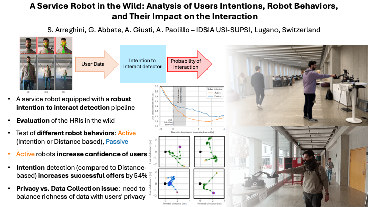
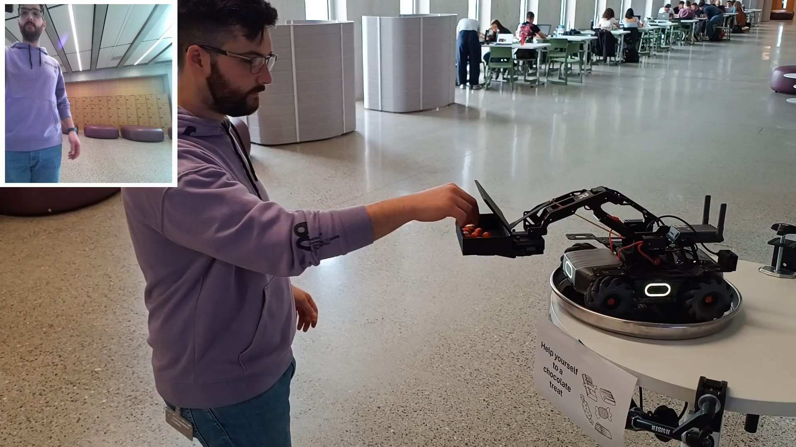

# A Service Robot in the Wild: Analysis of Users Intentions, Robot Behaviors, and Their Impact on the Interaction

*Simone Arreghini, Gabriele Abbate, Alessandro Giusti, and Antonio Paolillo*

Dalle Molle Institute for Artificial Intelligence, USI-SUPSI, Lugano (Switzerland)

### Graphical Abstract



### Paper Abstract

We consider a service robot that offers chocolate treats to people passing in its proximity: it has the capability of predicting in advance a person's intention to interact, and to actuate an "offering" gesture, subtly extending the tray of chocolates towards a given target. We run the system for more than 5 hours across 3 days and two different crowded public locations; the system implements three possible behaviors that are randomly toggled every few minutes: passive (e.g. never performing the offering gesture); or active, triggered by either a naive distance-based rule, or a smart approach that relies on various behavioral cues of the user. We collect a real-world dataset that includes information on 1777 users with several spontaneous human-robot interactions and study the influence of robot actions on people's behavior. Our comprehensive analysis suggests that users are more prone to engage with the robot when it proactively starts the interaction. We release the dataset and provide insights to make our work reproducible for the community. Also, we report qualitative observations collected during the acquisition campaign and identify future challenges and research directions in the domain of social human-robot interaction.

The paper has been accepted at IROS 2024. The pdf is available on arXiv [here](todo).

### IROS Video Submission (Click to start the video)

[](https://youtu.be/NNgbNRxm5V4)

Cite this work:
```
@inproceedings{Arreghini:iros:2024,
 author = {S. Arreghini and G. Abbate and A. Giusti and A. Paolillo},
 title = {A Service Robot in the Wild: Analysis of Users Intentions, Robot Behaviors, and Their Impact on the Interaction},
 booktitle={2024 IEEE/RSJ International Conference on Intelligent Robots and Systems (IROS)}, 
 pages = {--},
 year = {2024},
}
```
